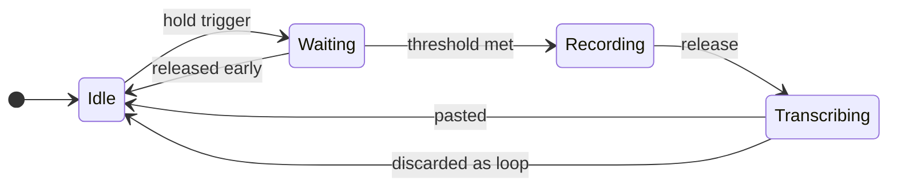

<div align="center">

# 🎙️ WhisperLocal

**Push-to-talk dictation for macOS. Hold a key, speak, and your words appear at the cursor.**

Everything runs on your Mac. No account, no API key, no network call, no upload.

[](LICENSE)
[](#requirements)
[](#requirements)
[](#privacy)

</div>

---

```bash
curl -fsSL https://raw.githubusercontent.com/shivamdixit17/whisperlocal/main/install.sh | bash
```

That is the whole install. It sets up everything it needs, then tells you which
macOS permissions to grant.

<details>
<summary><b>Prefer to read the script before running it?</b> (recommended)</summary>

<br>

Piping a script from the internet straight into your shell means running code
you have not read. If that makes you uneasy — it reasonably might — do it in
two steps:

```bash
curl -fsSL https://raw.githubusercontent.com/shivamdixit17/whisperlocal/main/install.sh -o install.sh
less install.sh          # read it
bash install.sh
```

Or skip the script entirely. If you already have [uv](https://docs.astral.sh/uv/)
and `ffmpeg`:

```bash
uv tool install git+https://github.com/shivamdixit17/whisperlocal.git
```

</details>

---

## What it does

Hold the **Fn (globe)** key. Speak. Let go. A moment later your words are typed
in at the cursor — in your editor, your browser, Slack, a terminal, anywhere
text goes.



By default there is no arming delay — recording starts the instant the key goes
down, so you can talk straight away. Stray taps are thrown out afterwards by
`min_recording_duration`, so nothing gets pasted from a brush of the key.

## Why this instead of the built-in dictation

|  | WhisperLocal | macOS Dictation |
|---|---|---|
| Where audio goes | Never leaves your Mac | May be sent to Apple for server-based dictation |
| Model | Whisper, your choice of size | Fixed |
| Works offline | Always | Only with on-device dictation enabled |
| Trigger | Any key you pick, including Fn and mouse buttons | Fixed shortcut, toggle-style |
| Punctuation | Inferred by Whisper | You often speak it aloud |
| Garbled output | Detected and discarded | Pasted anyway |
| Your own stats | `whisperlocal stats` | None |

## Features

- **Push-to-talk** — hold to record, release to transcribe. No toggle to forget about.
- **Trigger on almost anything** — the Fn/globe key, right-hand modifiers, F13–F19, or a mouse button. List several and any of them works.
- **Runs on the GPU** — [MLX](https://github.com/ml-explore/mlx), Apple's own framework.
- **Genuinely offline** — after the model downloads once, it never touches the network again.
- **Hallucination guard** — Whisper loops on short or noisy audio and emits one word hundreds of times. That output is detected and thrown away instead of dumped into whatever you had focused.
- **Pastes anywhere** — straight into the app you were in when you started talking.
- **Menu bar app** — SF Symbol status icon, last transcription, on/off toggle.
- **A single quiet dot** near the bottom of the screen: red breathing while recording, amber while transcribing.
- **Your own dictation stats** — `whisperlocal stats` shows words, speaking rate, transcription latency, failure rates, which apps you dictate into and words per day.
- **`whisperlocal doctor`** — tells you exactly what is misconfigured instead of failing silently.

## Requirements

- **Apple Silicon Mac** (M1 or newer). MLX does not run on Intel Macs — WhisperLocal says so rather than crashing.
- **macOS 13+**
- **Python 3.11+** — the installer handles this for you via uv
- **~1 GB of disk** for dependencies, plus the model you choose

> The dependency footprint is large because `mlx-whisper` pulls in PyTorch for
> its tokenizer. That is upstream, not something this project adds.

## Usage

```bash
whisperlocal
```

An icon appears in your menu bar. Then hold your trigger, speak, and release.

### Command line

```bash
whisperlocal                        # start the menu bar app
whisperlocal doctor                 # check your setup, diagnose problems
whisperlocal stats                  # summarise your dictation history
whisperlocal stats --days 7         # ...for the last week
whisperlocal config --init          # create a config file
whisperlocal config --show          # show the settings actually in effect
whisperlocal --trigger fn,f13       # override triggers for one run
whisperlocal --model small          # override the model for one run
```

## Trigger keys

Set `trigger_keys` to any combination. Holding **any one** of them dictates, and
whichever you press first owns the recording until you let go — so pressing a
second trigger mid-sentence will not cut you off.

```toml
trigger_keys = ["fn", "f13", "mouse_middle"]
```

| Value | Notes |
|---|---|
| `fn` | **Default.** The globe key. Watched through a Quartz event tap, because Fn is not a keycode at all — it is only a modifier flag bit, and pynput cannot see it |
| `alt_r` `shift_r` | Right-hand modifiers. Safe: rarely pressed alone |
| `f13`–`f19` | Most keyboards never send these. If you have a programmable keyboard, mapping a spare key to F13 makes an excellent dedicated dictation button |
| `alt_l` `cmd_r` `ctrl_r` | Work, but these are used by ordinary shortcuts — holding one during a shortcut starts a recording |
| `mouse_left` `mouse_right` `mouse_middle` | Dictate from the mouse when you are not near the keyboard. Read the section below first |

Fn, ordinary keys and mouse buttons use three different mechanisms, and all
three listeners run together, so mixing them is fine.

### Dictating from the mouse

Useful when you are away from the keyboard. It needs care, because holding the
left button is also what every drag, text selection, window move and slider
does. Two settings make it workable:

```toml
trigger_keys = ["fn", "mouse_left"]
mouse_hold_threshold = 1.0    # mouse buttons only; hold_threshold is often 0
mouse_drag_cancel_px = 10     # a press that travels this far is a drag
```

- **`mouse_hold_threshold`** is separate from `hold_threshold` on purpose. The key threshold defaults to `0.0`, which is right for a key you never otherwise press but would make every single click record. Mouse buttons must be held for a full second, and values below `0.3` are rejected.
- **`mouse_drag_cancel_px`** is what actually makes the left button usable. If the pointer travels more than this from where it went down, the press is a drag and the trigger is cancelled. Selecting text moves well past 10 px within a second; a hand holding still to talk does not.
- The drag guard only applies **before** recording starts. Once you are recording, move the mouse wherever you like — you are clearly dictating on purpose by then.

Even so, a long press held still on a button or a folder can start a recording.
`mouse_right` or `mouse_middle` avoid nearly all of this and are the better
choice if they are free on your mouse.

## Permissions

macOS grants these to **the app that launches WhisperLocal** — your terminal —
not to WhisperLocal itself. This is how macOS works for any tool like this.

Open **System Settings → Privacy & Security** and add your terminal to:

| Permission | Why it is needed | Without it |
|---|---|---|
| **Input Monitoring** | To see the trigger while another app is focused, and to create the Fn event tap | The trigger never fires |
| **Microphone** | To hear you | Nothing records |
| **Accessibility** | To press ⌘V for you | Text is copied to your clipboard; you paste it |

Quit and reopen your terminal afterwards, then run `whisperlocal doctor`.

> Don't want to grant Accessibility? Set `paste_mode = "clipboard"`.
> WhisperLocal will copy transcriptions and let you paste them yourself.

## Configuration

Everything is optional — the defaults work.

```bash
whisperlocal config --init && open ~/.config/whisperlocal/config.toml
```

| Setting | Default | What it does |
|---|---|---|
| `trigger_keys` | `["fn"]` | Hold any of these to dictate |
| `hold_threshold` | `0.0` | Seconds to hold before recording. `0` starts immediately |
| `mouse_hold_threshold` | `1.0` | Same, for mouse buttons. Minimum `0.3` |
| `mouse_drag_cancel_px` | `10` | A press travelling further than this is a drag, not dictation |
| `min_recording_duration` | `0.5` | Shorter recordings are discarded as noise |
| `model` | `"base"` | Short name, or any Hugging Face repo id |
| `language` | `"en"` | Language code, or `"auto"` |
| `fp16` | `false` | Half precision |
| `paste_mode` | `"paste"` | `"paste"` presses ⌘V; `"clipboard"` only copies |
| `sounds` | `true` | System sounds for each state |
| `overlay` | `true` | The floating dot |
| `history_enabled` | `true` | Record dictations for `whisperlocal stats` |
| `history_text` | `true` | Store the words themselves, not just the statistics |
| `max_word_run` | `4` | Longest allowed run of one repeated word before output is judged a loop |
| `max_repeat_ratio` | `0.30` | Below this unique-word ratio, output is judged a loop |
| `icon_color` | `[1.0, 0.58, 0.0]` | Menu bar glyph colour; `[]` for a monochrome template icon |

Every setting also works as an environment variable:

```bash
WHISPERLOCAL_MODEL=small WHISPERLOCAL_TRIGGER_KEYS=fn,f13 whisperlocal
```

**Precedence:** defaults → `~/.config/whisperlocal/config.toml` → environment variables → command-line flags.

## Models

Download sizes are measured from the actual Hugging Face repos. Weights are
fetched once, cached in `~/.cache/huggingface`, and reused offline forever after.

| Model | Download | Parameters | Best for |
|---|---:|---:|---|
| `tiny` | 74 MB | 39 M | Quick notes; makes mistakes on names |
| `base` | 144 MB | 74 M | **Default.** The sweet spot for everyday dictation |
| `small` | 481 MB | 244 M | Noticeably better with jargon and accents |
| `medium` | 1.5 GB | 769 M | High accuracy, slower |
| `large-v3-turbo` | 1.6 GB | 809 M | Best accuracy; nearly as fast as `medium` |

Any Hugging Face repo id also works. Note the `-mlx` suffix on the community
builds — the un-suffixed names (`mlx-community/whisper-base`) do not resolve and
return HTTP 401 on download.

> Speed depends on your chip, so this table deliberately prints no latency
> numbers. Your own are in `whisperlocal stats`.

## Your dictation stats

Every dictation, successful or not, is appended to a JSONL file. Failures are
logged too — the hallucination rate is only measurable if they are.

```bash
whisperlocal stats
```

```
  dictations      29  (25 produced text)
  words dictated  840
  time speaking   8.3 min
  speaking rate   107 wpm avg
  transcribe time 1395 ms avg, 805 ms median, 6418 ms worst

  outcomes
    ok                 25   86.2%  ████████████████████····
    empty               2    6.9%  █·······················
    hallucination       1    3.4%  ························
```

...plus which apps you dictate into and words per day.

One JSON object per line, append-only, so it reads straight into anything:

```bash
jq -r 'select(.status=="ok") | .text' ~/Library/Application\ Support/WhisperLocal/history.jsonl
```

```python
pandas.read_json(path, lines=True)
```

> **This file is a permanent, unencrypted, plain-text record of everything you
> dictate.** It is on by default. It lives in Application Support rather than
> Documents specifically because Documents is iCloud-synced on many Macs, which
> would upload the lot.
>
> - `history_text = false` keeps the statistics but not the words
> - `history_enabled = false` turns it off entirely
> - Deleting the file is a complete purge; nothing is indexed anywhere else

## Privacy

- **No network calls at runtime.** The only download ever made is the model, once. After that you can run WhisperLocal with Wi-Fi off permanently.
- **No account, no API key, no telemetry, no analytics.**
- **Audio never leaves your Mac.** Recordings go to `~/Library/Caches/WhisperLocal/` and are deleted immediately after transcription.
- **The history file never leaves your Mac either** — but it is stored in plain text. See the box above.
- **Transcriptions go to your clipboard**, as they must, in order to be pasted.

## Troubleshooting

Start here — it checks every requirement and points at what is wrong:

```bash
whisperlocal doctor
```

<details>
<summary><b>The trigger does nothing</b></summary>

Grant **Input Monitoring** to your terminal, then fully quit and reopen it
(closing the window is not enough). `whisperlocal doctor` will tell you
specifically whether the Fn event tap can be created.
</details>

<details>
<summary><b>Text does not paste, but nothing errors</b></summary>

Accessibility permission is missing. The text is still on your clipboard —
press ⌘V. Some apps (a few password managers, secure input fields) refuse
synthetic keystrokes on purpose; `paste_mode = "clipboard"` is the workaround.
</details>

<details>
<summary><b>The mouse trigger fires while I am selecting text</b></summary>

Lower `mouse_drag_cancel_px` so shorter drags cancel it, or raise
`mouse_hold_threshold`. If it keeps happening, `mouse_right` or `mouse_middle`
avoid the conflict entirely.
</details>

<details>
<summary><b>The mouse trigger never fires</b></summary>

The opposite problem: your hand is drifting past `mouse_drag_cancel_px` during
the hold. Raise it to 20–25, or set it to `0` to switch the guard off.
</details>

<details>
<summary><b>It repeated one word over and over — or pasted nothing after I spoke</b></summary>

That is the hallucination guard doing its job: Whisper looped, and the output
was discarded rather than pasted. It shows up as `hallucination` in
`whisperlocal stats`. If real speech is being thrown away, raise `max_word_run`
or lower `max_repeat_ratio`.
</details>

<details>
<summary><b>Transcriptions are wrong or garbled</b></summary>

Move up a model size (`small` or `large-v3-turbo`). If you are not speaking
English, set `language` — naming your language is faster and more accurate than
`"auto"`.
</details>

<details>
<summary><b>"command not found: whisperlocal"</b></summary>

Open a new terminal, or `export PATH="$HOME/.local/bin:$PATH"`.
</details>

## Uninstall

```bash
curl -fsSL https://raw.githubusercontent.com/shivamdixit17/whisperlocal/main/uninstall.sh | bash
```

Removes the command, your settings and cached audio. **Your dictation history is
left alone** — delete `~/Library/Application Support/WhisperLocal/` yourself if
you want it gone. Downloaded models are also kept, since that cache is shared
with other Hugging Face tools; add `REMOVE_MODELS=1` to delete those too. `uv`
and `ffmpeg` are always left alone.

## Roadmap

Where the analytics are going, building on the history already collected:
grouping effort by topic rather than just by app, week-over-week trends, and a
local dashboard with real charts instead of ASCII bars. All of it staying on
device, as everything here does. Thoughts on which metrics would actually be
useful are welcome in an issue.

## Development

```bash
git clone https://github.com/shivamdixit17/whisperlocal.git
cd whisperlocal
uv sync
uv run whisperlocal doctor
```

`config.py` handles settings, `app.py` holds the recorder, transcriber, overlay,
state machine and menu bar app, `stats.py` reads the history and `cli.py` is the
entry point.

## Contributing

Issues and pull requests welcome. Worth knowing before you start:

- The state machine in `DictationEngine` is the heart of it — read that first.
- **Cocoa is not thread-safe, and on macOS the assertions are fatal.** Every call into AppKit, HIToolbox or Text Services goes through `run_on_main()`. There is one such place on purpose; keep it that way.
- Pasting deliberately does not use pynput's `Controller` — constructing one reaches Text Services and crashes off the main thread. Quartz posts the keystroke instead.
- Audio is drained from a thread we own, not a PortAudio callback, and recorded at the device's native rate. Both of those are worked-around crashes, not style choices; the comments explain why.
- Test on a real Apple Silicon Mac; CI can only check that the package builds.

## Built with

[MLX](https://github.com/ml-explore/mlx) · [mlx-whisper](https://github.com/ml-explore/mlx-examples/tree/main/whisper) · [OpenAI Whisper](https://github.com/openai/whisper) · [rumps](https://github.com/jaredks/rumps) · [pynput](https://github.com/moses-palmer/pynput) · [sounddevice](https://github.com/spatialaudio/python-sounddevice)

## License

[MIT](LICENSE) — do whatever you want with it.

---

<div align="center">

Built by **Shivam Dixit** · [@shivamdixit17](https://github.com/shivamdixit17)

If it saves you some typing, a ⭐ is appreciated.

</div>
