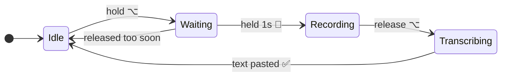

<div align="center">

# 🎙️ WhisperLocal

**Push-to-talk dictation for macOS. Hold a key, speak, and your words appear at the cursor.**

Everything runs on your Mac. No account, no API key, no network call, no upload.

[](LICENSE)
[](#requirements)
[](#requirements)
[](#privacy)

</div>

---

```bash
curl -fsSL https://raw.githubusercontent.com/shivamdixit17/whisperlocal/main/install.sh | bash
```

That is the whole install. It sets up everything it needs, then tells you which
macOS permissions to grant.

<details>
<summary><b>Prefer to read the script before running it?</b> (recommended)</summary>

<br>

Piping a script from the internet straight into your shell means running code
you have not read. If that makes you uneasy — it reasonably might — do it in
two steps instead:

```bash
curl -fsSL https://raw.githubusercontent.com/shivamdixit17/whisperlocal/main/install.sh -o install.sh
less install.sh          # read it
bash install.sh
```

Or skip the script entirely. If you already have [uv](https://docs.astral.sh/uv/)
and `ffmpeg`:

```bash
uv tool install git+https://github.com/shivamdixit17/whisperlocal.git
```

</details>

---

## What it does

Hold **Right Option (⌥)** for a second. A red indicator appears. Speak. Let go.
A moment later your words are typed in at the cursor — in your editor, your
browser, Slack, a terminal, anywhere text goes.



The hold threshold is the whole trick: a quick tap on the key does nothing, so
the microphone never opens by accident.

## Why this instead of the built-in dictation

|  | WhisperLocal | macOS Dictation |
|---|---|---|
| Where audio goes | Never leaves your Mac | May be sent to Apple for server-based dictation |
| Model | Whisper, your choice of size | Fixed |
| Works offline | Always | Only with on-device dictation enabled |
| Trigger | Any key you pick, push-to-talk | Fixed shortcut, toggle-style |
| Punctuation | Inferred by Whisper | You often speak it aloud |
| Cost | Free, MIT | Free |

## Features

- **Push-to-talk** — hold to record, release to transcribe. No toggle to forget about.
- **Runs on the GPU** — [MLX](https://github.com/ml-explore/mlx), Apple's own framework, so the Neural Engine and GPU do the work.
- **Genuinely offline** — after the model downloads once, it never touches the network again.
- **Pastes anywhere** — it writes into whatever app has focus.
- **Menu bar app** — live status, model switcher, on/off toggle.
- **On-screen indicator** — a floating HUD so you always know if the mic is open.
- **Audio cues** — distinct sounds for start, stop, done and failed.
- **Five models** — from 74 MB and instant to 1.6 GB and excellent.
- **`whisperlocal doctor`** — tells you exactly what is misconfigured instead of failing silently.

## Requirements

- **Apple Silicon Mac** (M1 or newer). MLX does not run on Intel Macs — WhisperLocal will tell you so rather than crashing.
- **macOS 13+**
- **Python 3.11+** — the installer handles this for you via uv
- **~1 GB of disk** for dependencies, plus the model you choose (see below)

> The dependency footprint is large because `mlx-whisper` pulls in PyTorch for
> its tokenizer. That is upstream, not something this project adds.

## Usage

Start it:

```bash
whisperlocal
```

A 🎙️ appears in your menu bar. Then:

1. **Hold Right Option (⌥)** for one second — a chime, and a red 🔴 indicator appears
2. **Speak**
3. **Release** — a pop, and the indicator switches to ⚙️
4. **Your text appears at the cursor** — a final chime confirms it

### Menu bar

| Item | What it does |
|---|---|
| **Status** | What the app is doing right now |
| **Last: …** | Click to copy your last transcription again |
| **Enabled ✅ / ❌** | Suspend dictation without quitting |
| **Model ▸** | Switch model on the fly |
| **Quit** | Exit |

### Command line

```bash
whisperlocal                      # start the menu bar app
whisperlocal doctor               # check your setup, diagnose problems
whisperlocal config --init        # create a config file
whisperlocal config --show        # show the settings actually in effect
whisperlocal --model small        # override the model for one run
whisperlocal --language de        # override the language for one run
```

## Permissions

macOS grants these to **the app that launches WhisperLocal** — your terminal —
not to WhisperLocal itself. This is how macOS works for any tool like this, and
it is worth knowing so the settings screen makes sense.

Open **System Settings → Privacy & Security** and add your terminal to:

| Permission | Why it is needed | Without it |
|---|---|---|
| **Accessibility** | To press ⌘V for you | Text is copied to your clipboard; you paste it |
| **Microphone** | To hear you | Nothing records |
| **Input Monitoring** | To see the trigger key while another app is focused | The hotkey never fires |

Quit and reopen your terminal afterwards. Then run `whisperlocal doctor` to
confirm.

> Don't want to grant Accessibility? Set `paste_mode = "clipboard"` in your
> config. WhisperLocal will copy transcriptions and let you paste them yourself.

## Configuration

Everything is optional — the defaults work. To customize:

```bash
whisperlocal config --init && open ~/.config/whisperlocal/config.toml
```

| Setting | Default | What it does |
|---|---|---|
| `trigger_key` | `"alt_r"` | The push-to-talk key. See the list below. |
| `hold_threshold` | `1.0` | Seconds to hold before recording starts. `0` for instant. |
| `min_recording_duration` | `0.5` | Recordings shorter than this are discarded as noise. |
| `model` | `"base"` | Which Whisper model to use. |
| `language` | `"en"` | Language code, or `"auto"` to detect it. |
| `fp16` | `true` | Half precision. Faster on Apple Silicon. |
| `sample_rate` | `16000` | Whisper is trained at 16 kHz; rarely worth changing. |
| `paste_mode` | `"paste"` | `"paste"` presses ⌘V for you; `"clipboard"` only copies. |
| `sounds` | `true` | System sounds for each state. |
| `overlay` | `true` | The floating on-screen indicator. |

Every setting also works as an environment variable, which is handy for trying
something once:

```bash
WHISPERLOCAL_MODEL=small WHISPERLOCAL_LANGUAGE=auto whisperlocal
```

**Precedence:** built-in defaults → `~/.config/whisperlocal/config.toml` → environment variables → command-line flags.

### Trigger keys

`alt_r` · `alt_l` · `cmd_r` · `ctrl_r` · `shift_r` · `f13`–`f19`

Only keys that are safe to hold down are offered: right-hand modifiers you
rarely press alone, and the F13–F19 block most keyboards never send. If you
have a programmable keyboard, mapping a spare key to F13 makes an excellent
dedicated dictation button.

## Models

Download sizes are measured from the actual Hugging Face repos. Weights are
fetched once, cached in `~/.cache/huggingface`, and reused offline forever after.

| Model | Download | Parameters | Best for |
|---|---:|---:|---|
| `tiny` | 74 MB | 39 M | Quick notes; makes mistakes on names |
| `base` | 144 MB | 74 M | **Default.** The sweet spot for everyday dictation |
| `small` | 481 MB | 244 M | Noticeably better with jargon and accents |
| `medium` | 1.5 GB | 769 M | High accuracy, slower |
| `large-v3-turbo` | 1.6 GB | 809 M | Best accuracy; nearly as fast as `medium` |

Switch any time from the **Model** menu, or set `model` in your config.

> Speed depends on your chip, so this table deliberately does not print
> latency numbers. Try `base` first; if it keeps mishearing you, move up.

## Privacy

The reason this project exists.

- **No network calls at runtime.** The only download ever made is the model, once, on first use. After that you can run WhisperLocal with Wi-Fi off permanently.
- **No account, no API key, no telemetry, no analytics.**
- **Audio never leaves your Mac.** Recordings are written to `~/Library/Caches/WhisperLocal/` and deleted immediately after transcription.
- **Transcriptions go to your clipboard**, as they must, in order to be pasted. Anything with clipboard access can read them — the same is true of anything you copy.

## Troubleshooting

Start here — it checks every requirement and points at what is wrong:

```bash
whisperlocal doctor
```

<details>
<summary><b>The hotkey does nothing</b></summary>

Grant **Input Monitoring** to your terminal, then fully quit and reopen it
(closing the window is not enough). If another app has claimed the same key,
pick a different `trigger_key`.
</details>

<details>
<summary><b>Text does not paste, but nothing errors</b></summary>

Accessibility permission is missing. The text is still on your clipboard —
press ⌘V. Run `whisperlocal doctor` to confirm, and grant Accessibility to
your terminal. Some apps (a few password managers, secure input fields) refuse
synthetic keystrokes on purpose; `paste_mode = "clipboard"` is the workaround.
</details>

<details>
<summary><b>Nothing gets recorded</b></summary>

Grant **Microphone** permission. Check the input device in System Settings →
Sound. `whisperlocal doctor` prints which device it would use.
</details>

<details>
<summary><b>The first dictation takes forever</b></summary>

That is the model downloading. Sizes are in the table above. It happens once.
</details>

<details>
<summary><b>Transcriptions are wrong or garbled</b></summary>

Move up a model size (`small` or `large-v3-turbo`). If you are not speaking
English, set `language` — naming your language is both faster and more accurate
than `"auto"`.
</details>

<details>
<summary><b>"command not found: whisperlocal"</b></summary>

The install directory is not on your PATH. Open a new terminal, or:

```bash
export PATH="$HOME/.local/bin:$PATH"
```
</details>

## Uninstall

```bash
curl -fsSL https://raw.githubusercontent.com/shivamdixit17/whisperlocal/main/uninstall.sh | bash
```

Removes the command, your settings and cached audio. Downloaded models are
listed and kept, since that cache is shared with other Hugging Face tools — add
`REMOVE_MODELS=1` to delete those too. `uv` and `ffmpeg` are always left alone.

## Roadmap

### Local dictation analytics — planned for v1.1

> Not built yet. This section describes where the project is going, not what it
> does today.

Everything you dictate already runs through your own machine. The next release
turns that into a private picture of your working day — without a single byte
leaving your Mac.

The idea: if you dictate notes, messages and commit descriptions all day, that
stream quietly describes where your effort actually went. Today it is thrown
away the moment it is pasted.

Planned:

- **Where your effort goes** — time and word volume grouped by the app you were dictating into, and by topic pulled from the text itself
- **KPIs worth watching** — words dictated, sessions per day, active hours, average session length, longest focused stretch
- **Trends** — how this week compares to last, which days are heavy, when you actually do your talking
- **A local dashboard** — charts served from `whisperlocal stats`, opened in your browser from `localhost`, generated on your machine
- **Export** — plain JSON and CSV, so it is your data in a format you can use elsewhere

Non-negotiables it will ship with:

- **Off by default.** Nothing is recorded until you turn it on.
- **On-device only.** A local database. No account, no sync, no upload — the same rule the rest of the app follows.
- **Yours to delete.** One command wipes the history; one setting stops collection.
- **Retention you choose**, and the option to store only metadata (counts, timings, the app you were in) without keeping the transcribed text at all.

Have thoughts on which metrics would actually be useful? Open an issue.

## Development

```bash
git clone https://github.com/shivamdixit17/whisperlocal.git
cd whisperlocal
uv sync
uv run whisperlocal doctor
```

The project is deliberately small: `config.py` handles settings, `app.py` holds
the recorder, transcriber, overlay, state machine and menu bar app, and `cli.py`
is the entry point.

## Contributing

Issues and pull requests are welcome. Useful things to know:

- The state machine in `DictationEngine` is the heart of it — read that first.
- Cocoa is not thread-safe. All overlay updates go through `FloatingOverlay._on_main_thread`.
- Test on a real Apple Silicon Mac; CI can only check that the package builds.

## Built with

[MLX](https://github.com/ml-explore/mlx) · [mlx-whisper](https://github.com/ml-explore/mlx-examples/tree/main/whisper) · [OpenAI Whisper](https://github.com/openai/whisper) · [rumps](https://github.com/jaredks/rumps) · [pynput](https://github.com/moses-palmer/pynput) · [sounddevice](https://github.com/spatialaudio/python-sounddevice)

## License

[MIT](LICENSE) — do whatever you want with it.

---

<div align="center">

Built by **Shivam Dixit** · [@shivamdixit17](https://github.com/shivamdixit17)

If it saves you some typing, a ⭐ is appreciated.

</div>
