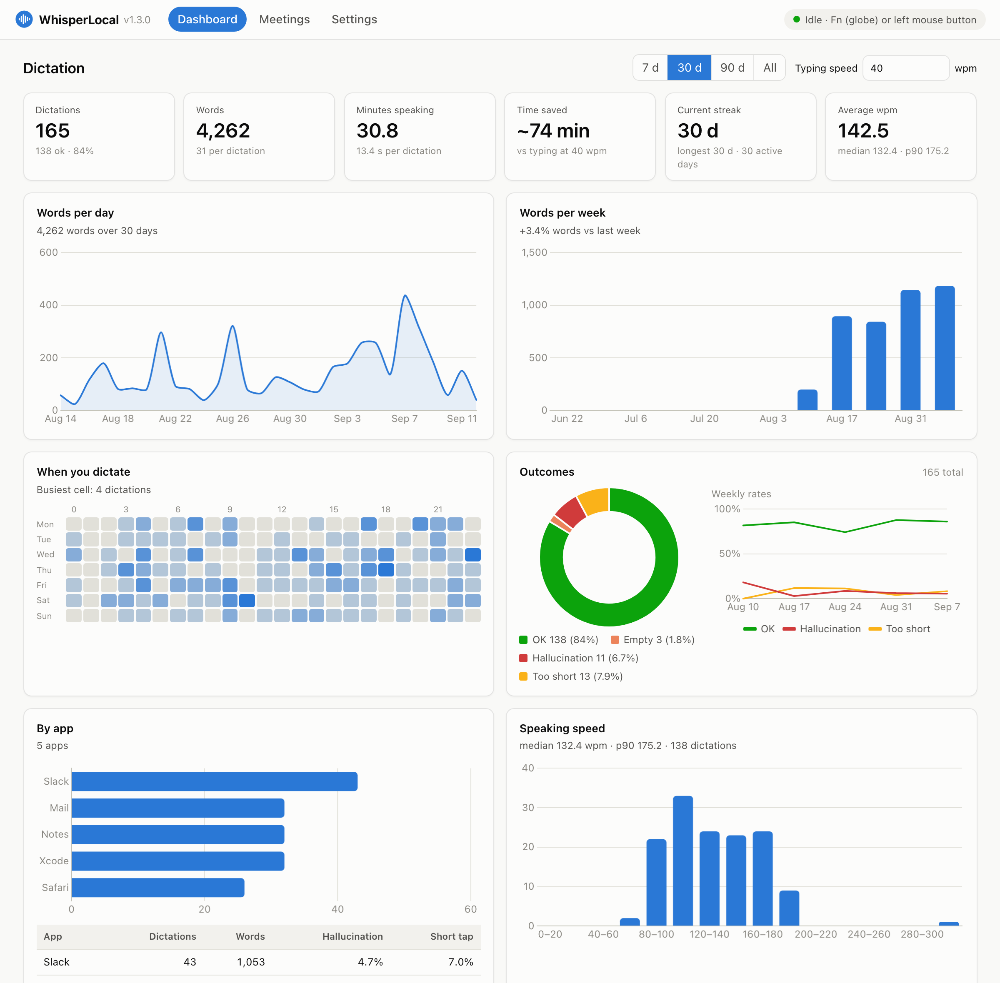
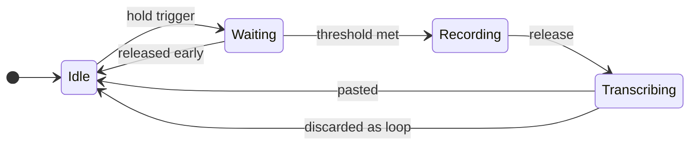
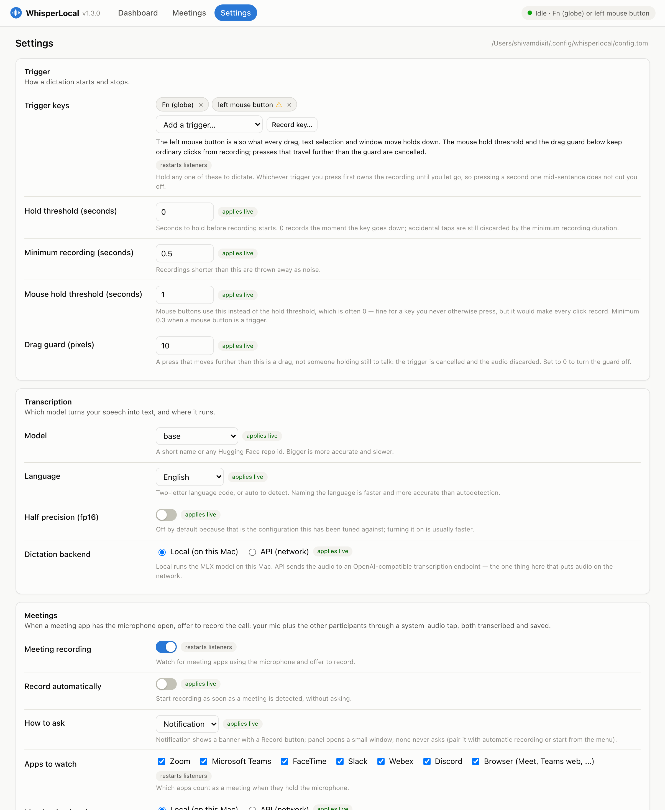
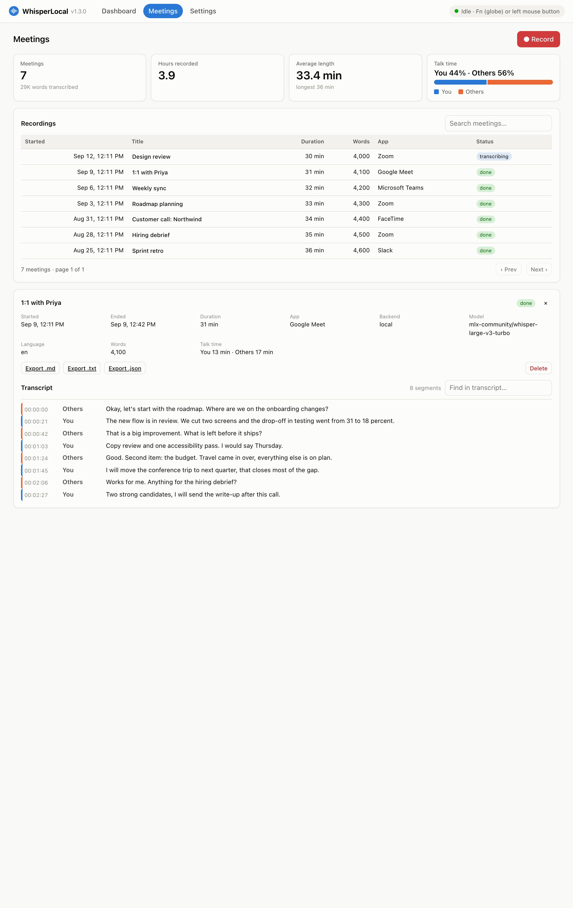

<div align="center">


# WhisperLocal

**Push-to-talk dictation for macOS. Hold a key, speak, and your words appear at the cursor.**

Everything runs on your Mac. No account, no API key, no network call, no upload.
(A cloud backend exists for meetings and dictation; it is off until you turn it on.)

[](LICENSE)
[](#requirements)
[](#requirements)
[](#privacy)

<br>

<picture>
  <source media="(prefers-color-scheme: dark)" srcset="docs/screenshots/dashboard-dark.png">
  
</picture>

<sub>The dashboard, on sample data. Everything it shows is computed from a file on your Mac.</sub>

</div>

---

```bash
curl -fsSL https://raw.githubusercontent.com/shivamdixit17/whisperlocal/main/install.sh | bash
```

That is the whole install, and the only time you need a terminal. It installs
WhisperLocal as a real menu bar app in `~/Applications`, starts it, and sets it
to launch at login. From then on it is just there — no command to run, no window
to keep open, and it survives a reboot.

<details>
<summary><b>Prefer to read the script before running it?</b> (recommended)</summary>

<br>

Piping a script from the internet straight into your shell means running code
you have not read. If that makes you uneasy — it reasonably might — do it in
two steps:

```bash
curl -fsSL https://raw.githubusercontent.com/shivamdixit17/whisperlocal/main/install.sh -o install.sh
less install.sh          # read it
bash install.sh
```

Or skip the script entirely. If you already have [uv](https://docs.astral.sh/uv/)
and `ffmpeg`:

```bash
uv tool install git+https://github.com/shivamdixit17/whisperlocal.git
```

</details>

---

## What's new in 1.3.0

The biggest release so far. WhisperLocal was a push-to-talk tool with a
terminal for everything else; it is now a small dictation *and* meetings app
with a proper face.

| | What it is | Where |
|---|---|---|
| **Meeting recording** | Notices when Zoom, Teams, FaceTime, Slack, Webex, Discord or a browser call has your mic open and offers to record. Captures you *and* the other participants (system-audio tap), transcribes while the call runs, labels the speakers, saves Markdown/JSON/FLAC, and lets you search and export. Manual Start/Stop too. | [Meetings](#meetings) |
| **Dashboard** | Real charts over your dictation history: words per day and week, when you dictate, outcomes and hallucination rate, per-app breakdown, speaking speed, latency, streaks, top phrases, a searchable table. | [Dashboard and settings](#dashboard-and-settings) |
| **Settings page** | Every setting editable in the browser, with the explanation beside it. Changes apply live; a **Record key** button captures your trigger key. `config.toml` is rewritten with its comments intact. | [Dashboard and settings](#dashboard-and-settings) |
| **Cloud transcription, opt-in** | Point dictation or meetings at any OpenAI-compatible endpoint when a bigger model is worth the upload. The key lives in the macOS Keychain. Local stays the default and makes no network calls. | [Cloud transcription](#cloud-transcription) |
| **Menu bar icon** | Monochrome and template-rendered, like the system's own icons, following light and dark mode. One logo everywhere: menu bar, dashboard, favicon, this page. | [Usage](#usage) |
| **CLI** | `whisperlocal dashboard`, `whisperlocal meetings list\|show\|search\|export\|delete\|transcribe`, `whisperlocal api-key set`, `whisperlocal stats --json` and `--meetings`; `doctor` checks the new pieces. | [Command line](#command-line) |
| **Under the hood** | `app.py` split into focused modules, a test suite that runs on Linux CI, live settings reload, and one carefully handled change to the sealed app bundle. | [Development](#development) |

Upgrading is the same one-liner as installing. The full story is in the
[changelog](CHANGELOG.md).

## What it does

Hold the **Fn (globe)** key. Speak. Let go. A moment later your words are typed
in at the cursor — in your editor, your browser, Slack, a terminal, anywhere
text goes. A small red dot pulses next to your cursor while it listens, so you
always know the microphone is open and where the text is going to land.



By default there is no arming delay — recording starts the instant the key goes
down, so you can talk straight away. Stray taps are thrown out afterwards by
`min_recording_duration`, so nothing gets pasted from a brush of the key.

## Why this instead of the built-in dictation

|  | WhisperLocal | macOS Dictation |
|---|---|---|
| Where audio goes | Never leaves your Mac, unless you opt into a cloud backend | May be sent to Apple for server-based dictation |
| Model | Whisper, your choice of size | Fixed |
| Works offline | Always | Only with on-device dictation enabled |
| Trigger | Any key you pick, including Fn and mouse buttons | Fixed shortcut, toggle-style |
| Punctuation | Inferred by Whisper | You often speak it aloud |
| Garbled output | Detected and discarded | Pasted anyway |
| Meetings | Recorded and transcribed, you and the others labelled | Not offered |
| Your own stats | `whisperlocal stats` and a local dashboard | None |

## Features

- **Push-to-talk** — hold to record, release to transcribe. No toggle to forget about.
- **Trigger on almost anything** — the Fn/globe key, right-hand modifiers, F13–F19, or a mouse button. List several and any of them works.
- **Runs on the GPU** — [MLX](https://github.com/ml-explore/mlx), Apple's own framework.
- **Offline by default** — after the model downloads once, it never touches the network again. A cloud backend exists for when a bigger model is worth the upload; it stays off until you switch it on.
- **Hallucination guard** — Whisper loops on short or noisy audio and emits one word hundreds of times. That output is detected and thrown away instead of dumped into whatever you had focused.
- **Pastes anywhere** — straight into the app you were in when you started talking.
- **A real Mac app** — installs to `~/Applications`, starts at login, lives in the menu bar. No terminal, ever.
- **Menu bar app** — a monochrome status icon that follows light and dark mode, last transcription, on/off toggle, permissions check, and the doors to the pages below.
- **A single quiet dot beside your text cursor**: red and breathing while recording, amber while transcribing.
- **Meeting recording** — when Zoom, Teams, FaceTime, Slack, Webex, Discord or a browser call has the microphone open, it offers to record. Your side and the other participants are captured as two tracks and transcribed while the call runs, labelled "You" and "Others". See [Meetings](#meetings).
- **A dashboard and a settings page** — served to your own browser from 127.0.0.1. Real charts over your dictation history, and every setting editable without opening a file; most apply on the spot.
- **Your own dictation stats** — `whisperlocal stats` in the terminal, the same numbers as charts in the dashboard, `--json` for anything else.
- **`whisperlocal doctor`** — tells you exactly what is misconfigured instead of failing silently.

## Requirements

- **Apple Silicon Mac** (M1 or newer). MLX does not run on Intel Macs — WhisperLocal says so rather than crashing.
- **macOS 13+** — 14.2 or newer to capture the other participants in a meeting; older versions record your microphone only
- **Python 3.11+** — the installer handles this for you via uv
- **~1 GB of disk** for dependencies, plus the model you choose

> The dependency footprint is large because `mlx-whisper` pulls in PyTorch for
> its tokenizer. That is upstream, not something this project adds.

## Usage

After installing, it is already running and will start again at every login.
Hold your trigger, speak, release. There is nothing to launch.

The menu bar icon gives you status, your last transcription, an on/off toggle,
Start / Stop Meeting Recording, the Dashboard…, Settings… and Meetings… pages,
a permissions check, Restart and Quit.

### Command line

You never need these, but they are there:

```bash
whisperlocal doctor                 # check your setup, diagnose problems
whisperlocal stats                  # summarise your dictation history
whisperlocal stats --days 7         # ...for the last week
whisperlocal stats --json           # the dashboard's numbers, as JSON
whisperlocal stats --meetings       # meeting statistics, as JSON
whisperlocal dashboard              # open the dashboard in your browser
whisperlocal dashboard --tab settings
whisperlocal meetings list          # recorded meetings; also show, search, export, delete, transcribe
whisperlocal api-key set            # store a cloud transcription key in the Keychain
whisperlocal config --init          # create a config file
whisperlocal config --show          # show the settings actually in effect
whisperlocal probe-caret            # does this app report its text cursor?
whisperlocal install-app            # (re)install the menu bar app, repair it
whisperlocal uninstall-app          # remove the app and its login item
whisperlocal                        # run in the foreground, for debugging
whisperlocal --trigger fn,f13       # override triggers for one run
whisperlocal --model small          # override the model for one run
```

### Where it lives

| | |
|---|---|
| `~/Applications/WhisperLocal.app` | The app. Starts at login; owns the macOS permissions |
| `~/Applications/WhisperLocal/start.sh` | Restarts it if it ever crashes |
| `~/.config/whisperlocal/config.toml` | Your settings |
| `~/Library/Application Support/WhisperLocal/history.jsonl` | Your dictation history |
| `~/Library/Application Support/WhisperLocal/meetings/` | Recorded meetings, one folder each |
| `~/Library/Logs/WhisperLocal.log` | What it has been doing |

The app bundle is deliberately tiny and never changes between releases. macOS
ties your granted permissions to its exact contents, so upgrades leave it
untouched — otherwise every update would silently revoke them. 1.3 is the one
exception: meeting recording needed a line in the bundle's `Info.plist`, so
upgrading from an earlier version asks you to grant Accessibility and Input
Monitoring once more. See [Permissions](#permissions).

## Trigger keys

Set `trigger_keys` to any combination. Holding **any one** of them dictates, and
whichever you press first owns the recording until you let go — so pressing a
second trigger mid-sentence will not cut you off.

```toml
trigger_keys = ["fn", "f13", "mouse_middle"]
```

| Value | Notes |
|---|---|
| `fn` | **Default.** The globe key. Watched through a Quartz event tap, because Fn is not a keycode at all — it is only a modifier flag bit, and pynput cannot see it |
| `alt_r` `shift_r` | Right-hand modifiers. Safe: rarely pressed alone |
| `f13`–`f19` | Most keyboards never send these. If you have a programmable keyboard, mapping a spare key to F13 makes an excellent dedicated dictation button |
| `alt_l` `cmd_r` `ctrl_r` | Work, but these are used by ordinary shortcuts — holding one during a shortcut starts a recording |
| `mouse_left` `mouse_right` `mouse_middle` | Dictate from the mouse when you are not near the keyboard. Read the section below first |

Fn, ordinary keys and mouse buttons use three different mechanisms, and all
three listeners run together, so mixing them is fine.

### Dictating from the mouse

Useful when you are away from the keyboard. It needs care, because holding the
left button is also what every drag, text selection, window move and slider
does. Two settings make it workable:

```toml
trigger_keys = ["fn", "mouse_left"]
mouse_hold_threshold = 1.0    # mouse buttons only; hold_threshold is often 0
mouse_drag_cancel_px = 10     # a press that travels this far is a drag
```

- **`mouse_hold_threshold`** is separate from `hold_threshold` on purpose. The key threshold defaults to `0.0`, which is right for a key you never otherwise press but would make every single click record. Mouse buttons must be held for a full second, and values below `0.3` are rejected.
- **`mouse_drag_cancel_px`** is what actually makes the left button usable. If the pointer travels more than this from where it went down, the press is a drag and the trigger is cancelled. Selecting text moves well past 10 px within a second; a hand holding still to talk does not.
- The drag guard only applies **before** recording starts. Once you are recording, move the mouse wherever you like — you are clearly dictating on purpose by then.

Even so, a long press held still on a button or a folder can start a recording.
`mouse_right` or `mouse_middle` avoid nearly all of this and are the better
choice if they are free on your mouse.

## Permissions

WhisperLocal asks for these itself on first launch, with a button that opens the
right Settings pane. You grant them to **WhisperLocal**, not to your terminal,
because the installer sets it up as a proper app bundle.

| Permission | Why it is needed | Without it |
|---|---|---|
| **Input Monitoring** | To see the trigger while another app is focused, and to create the Fn event tap | The trigger never fires |
| **Accessibility** | To press ⌘V for you, and to find your text cursor | Text is copied to your clipboard but not pasted; the dot falls back to your mouse |
| **Microphone** | To hear you | Nothing records |
| **System Audio Recording** | To hear the other participants in a meeting, through a CoreAudio process tap | Meetings record your microphone only |

**The microphone needs nothing from you in advance** — macOS prompts for it the
first time you dictate.

**System Audio Recording is only asked for when a meeting recording starts.**
If you never record a meeting you never see the prompt. macOS calls it "System
Audio Recording Only", and it needs macOS 14.2 or newer; before that there is
no tap to ask about, and meetings capture your side alone.

**The other two cannot be automated.** macOS deliberately requires a human to
switch them on in System Settings; no installer of any kind can do it for you.
WhisperLocal opens the exact pane so it is two clicks rather than a hunt. Quit
and reopen it from the menu bar afterwards, then check with `whisperlocal
doctor`. There is a **Permissions…** item in the menu to re-check any time.

**Upgrading from 1.2 or earlier may ask for Accessibility and Input Monitoring
once more.** The bundle that holds those grants had to gain one line — the
usage description for system audio. On the Macs this was tested on the
signature survived the change and nothing needed re-granting; if yours does
change, `whisperlocal install-app` says so and clears the stale toggles so a
fresh prompt appears instead of switches that look on but do nothing. No
further change to the sealed bundle is planned.

> Don't want to grant Accessibility? Set `paste_mode = "clipboard"`.
> WhisperLocal will copy transcriptions and let you paste them yourself.

## Configuration

Everything is optional — the defaults work. The **Settings…** page in the menu
bar edits all of it, with the explanation beside each field, and most changes
apply on the spot. The file is there if you prefer it:

```bash
whisperlocal config --init && open ~/.config/whisperlocal/config.toml
```

| Setting | Default | What it does |
|---|---|---|
| `trigger_keys` | `["fn"]` | Hold any of these to dictate |
| `hold_threshold` | `0.0` | Seconds to hold before recording. `0` starts immediately |
| `mouse_hold_threshold` | `1.0` | Same, for mouse buttons. Minimum `0.3` |
| `mouse_drag_cancel_px` | `10` | A press travelling further than this is a drag, not dictation |
| `min_recording_duration` | `0.5` | Shorter recordings are discarded as noise |
| `model` | `"base"` | Short name, or any Hugging Face repo id |
| `language` | `"en"` | Language code, or `"auto"` |
| `fp16` | `false` | Half precision |
| `paste_mode` | `"paste"` | `"paste"` presses ⌘V; `"clipboard"` only copies |
| `mlx_cache_mb` | `128` | Cap on MLX's GPU buffer cache — see [Memory](#memory) |
| `idle_release_seconds` | `60` | Drop that cache after this long without dictation |
| `sounds` | `true` | System sounds for each state |
| `overlay` | `true` | The floating dot |
| `overlay_anchor` | `"caret"` | `"caret"`, `"mouse"` or `"bottom"` — see below |
| `overlay_offset_x` / `overlay_offset_y` | `14` / `0` | Nudge the dot away from the anchor |
| `history_enabled` | `true` | Record dictations for `whisperlocal stats` |
| `history_text` | `true` | Store the words themselves, not just the statistics |
| `max_word_run` | `4` | Longest allowed run of one repeated word before output is judged a loop |
| `max_repeat_ratio` | `0.30` | Below this unique-word ratio, output is judged a loop |
| `dictation_backend` | `"local"` | `"local"` runs on this Mac; `"api"` sends audio to a server — see [Cloud transcription](#cloud-transcription) |
| `meeting_backend` | `"local"` | The same choice, for meetings |
| `api_base_url` | `"https://api.openai.com/v1"` | Where `"api"` sends audio. The key is in the Keychain, not here |
| `api_model` | `"whisper-1"` | The model name the server expects |
| `api_timeout_seconds` | `120` | Give up on a request after this |
| `meeting_enabled` | `true` | Watch for meetings at all |
| `meeting_auto_record` | `false` | Record without asking, and stop when the call ends |
| `meeting_prompt` | `"notification"` | How to ask: `"notification"`, `"panel"` or `"none"` |
| `meeting_apps` | `["zoom", "teams", "facetime", "slack", "webex", "discord", "browser"]` | Which apps count as a meeting |
| `meeting_system_audio` | `true` | Capture the other participants through a process tap (macOS 14.2+) |
| `meeting_system_device` | `""` | A virtual input device (BlackHole) to use instead of the tap |
| `meeting_transcribe_live` | `true` | Transcribe segments during the call rather than after it |
| `meeting_model` | `""` | A different model for meetings; empty means `model` |
| `meeting_segment_seconds` | `60` | Roughly how long each audio segment is, cut at a quiet moment |
| `meeting_silence_db` | `-45.0` | What counts as quiet for that cut |
| `meeting_end_grace_seconds` | `20` | Seconds without the mic in use before a call counts as over |
| `meeting_min_seconds` | `60` | Shorter detected calls are not kept |
| `meeting_keep_audio` | `true` | Keep the audio next to the transcript |
| `meeting_audio_format` | `"flac"` | `"flac"` or `"wav"` |
| `meeting_transcript_words` | `false` | Keep word-level timestamps (larger files) |
| `meeting_dir` | `"~/Library/Application Support/WhisperLocal/meetings"` | Where meetings are saved |
| `web_enabled` | `true` | Serve the dashboard and settings page on 127.0.0.1 |
| `web_port` | `47311` | Which port. The `web_*` settings are the only ones that need a restart |
| `icon_idle` … `icon_meeting_detected` | `"waveform"` … | SF Symbol names for each state |
| `icon_color` | `[]` | Empty for a monochrome template icon that follows light and dark mode; `[r, g, b]` pins a colour |

Every setting also works as an environment variable:

```bash
WHISPERLOCAL_MODEL=small WHISPERLOCAL_TRIGGER_KEYS=fn,f13 whisperlocal
```

**Precedence:** defaults → `~/.config/whisperlocal/config.toml` → environment variables → command-line flags.

## Memory

WhisperLocal sits in your menu bar all day, so it should not hoard memory.

| | |
|---|---|
| Just started | ~150 MB |
| Idle, after use | ~430 MB |
| Mid-dictation | ~660 MB |

Most of that is not the model — the Whisper weights are about 140 MB. The rest
is Python, MLX, and MLX's **buffer cache**: freed GPU memory it keeps for reuse
rather than handing back. Left alone that cache grows to roughly a gigabyte
after a few dictations and stays there, which is where the old ~1.6 GB figure
came from.

Two settings keep it in check, and you can trade memory against speed:

```toml
mlx_cache_mb = 128          # cap the cache; 0 disables it, -1 for no limit
idle_release_seconds = 60   # drop it entirely after this long idle
```

Measured with `whisper-base`, five transcriptions each, on an M-series Mac:

| `mlx_cache_mb` | Median transcription | Total footprint |
|---|---:|---:|
| `-1` (unlimited) | 230 ms | 1423 MB |
| `128` **(default)** | 265 ms | 660 MB |
| `64` | 298 ms | 556 MB |
| `0` | 364 ms | 491 MB |

The default keeps a burst of dictation fast, then releases the cache once you
stop, so the idle app settles near the floor. Want it smaller still? Drop
`mlx_cache_mb` to `0`. Want every millisecond? Set it to `-1`.

> **Changing the model barely moves this.** `tiny` saves about 70 MB against
> `base` and is noticeably less accurate. The cache is the thing worth tuning.

`whisperlocal doctor` prints the current figure.

## The recording dot

While recording, a small red dot pulses **next to your text cursor** — wherever
you happen to be typing — and turns steady amber while transcribing. It is
click-through, sits above everything, and appears on whichever monitor you are
working on.

```toml
overlay_anchor = "caret"    # "caret", "mouse" or "bottom"
```

Finding the cursor relies on the app you are typing in reporting its position to
macOS. Most native apps do. Many Electron apps and some browser text fields
never have, and there is nothing WhisperLocal can do about that — in those it
**falls back to your mouse pointer**, then to the bottom of the screen.

To see what a given app reports:

```bash
whisperlocal probe-caret --delay 5     # switch to the app you want to test
```

Prefer it somewhere fixed? `overlay_anchor = "bottom"` pins it above the Dock,
or `overlay = false` turns it off entirely.

## Models

Download sizes are measured from the actual Hugging Face repos. Weights are
fetched once, cached in `~/.cache/huggingface`, and reused offline forever after.

| Model | Download | Parameters | Best for |
|---|---:|---:|---|
| `tiny` | 74 MB | 39 M | Quick notes; makes mistakes on names |
| `base` | 144 MB | 74 M | **Default.** The sweet spot for everyday dictation |
| `small` | 481 MB | 244 M | Noticeably better with jargon and accents |
| `medium` | 1.5 GB | 769 M | High accuracy, slower |
| `large-v3-turbo` | 1.6 GB | 809 M | Best accuracy; nearly as fast as `medium` |

Any Hugging Face repo id also works. Note the `-mlx` suffix on the community
builds — the un-suffixed names (`mlx-community/whisper-base`) do not resolve and
return HTTP 401 on download.

> Speed depends on your chip, so this table deliberately prints no latency
> numbers. Your own are in `whisperlocal stats`.

## Your dictation stats

Every dictation, successful or not, is appended to a JSONL file. Failures are
logged too — the hallucination rate is only measurable if they are.

```bash
whisperlocal stats
```

```
  dictations      29  (25 produced text)
  words dictated  840
  time speaking   8.3 min
  speaking rate   107 wpm avg
  transcribe time 1395 ms avg, 805 ms median, 6418 ms worst

  outcomes
    ok                 25   86.2%  ████████████████████····
    empty               2    6.9%  █·······················
    hallucination       1    3.4%  ························
```

...plus which apps you dictate into and words per day.

One JSON object per line, append-only, so it reads straight into anything:

```bash
jq -r 'select(.status=="ok") | .text' ~/Library/Application\ Support/WhisperLocal/history.jsonl
```

```python
pandas.read_json(path, lines=True)
```

> **This file is a permanent, unencrypted, plain-text record of everything you
> dictate.** It is on by default. It lives in Application Support rather than
> Documents specifically because Documents is iCloud-synced on many Macs, which
> would upload the lot.
>
> - `history_text = false` keeps the statistics but not the words
> - `history_enabled = false` turns it off entirely
> - Deleting the file is a complete purge; nothing is indexed anywhere else

## Dashboard and settings

WhisperLocal runs a small web server for itself, bound to 127.0.0.1 and
nothing else. Choose **Dashboard…**, **Settings…** or **Meetings…** from the
menu bar and the page opens in your browser, or run `whisperlocal dashboard`
(`--tab settings`, or `--no-browser` to print the URL). The link it opens
carries a token for this run, which becomes a cookie; only loopback is
accepted, a page in another tab cannot drive the API, and nothing is loaded
from the internet — Chart.js ships inside the package.

The **dashboard** is your history file as charts: totals and the time saved
against typing it all, words per day and per week with the week-over-week
change, an hour-by-weekday heatmap of when you dictate, outcome rates and the
hallucination-rate trend, a per-app breakdown, your speaking-rate distribution,
transcription latency by model (p50 and p95), dictation lengths, streaks, your
most-used words and bigrams, and a searchable table of recent dictations.
`whisperlocal stats --json` prints the same numbers.

The **settings page** edits `config.toml` for you — comments and all — and
applies the change on the spot. Change the trigger keys and the listeners
restart without the app restarting; a **Record key** button captures the next
key you press or mouse button you hold, so there is no need to know that a
spare key is called `f13`. Only `web_enabled` and `web_port` need a restart,
and there is a Restart button for that. A setting overridden by an environment
variable is shown read-only, since the file would be ignored anyway.

<picture>
  <source media="(prefers-color-scheme: dark)" srcset="docs/screenshots/settings-dark.png">
  
</picture>

`web_enabled = false` turns the server off; `web_port` moves it (default
`47311`). If the port is taken, WhisperLocal picks a free one and says so in
the log.

## Meetings

When a meeting app has your microphone open, WhisperLocal notices. It watches
the same CoreAudio flag that lights the orange dot in the menu bar, filtered to
processes it recognises: Zoom, Microsoft Teams, FaceTime, Slack, Webex, Discord
and the browsers, which is how Google Meet and other web calls are caught. A
notification offers to **Record**; `meeting_auto_record = true` starts without
asking and stops when the call ends; `meeting_prompt` chooses a notification, a
dialog or nothing at all. **Start Meeting Recording** in the menu works any
time, whether or not anything was detected, and `meeting_apps` narrows which
apps count.

<picture>
  <source media="(prefers-color-scheme: dark)" srcset="docs/screenshots/meetings-dark.png">
  
</picture>


Two tracks are captured. Your microphone is one. The other participants are
the other, taken through a CoreAudio process tap on macOS 14.2 or newer — the
tap reads what the app is playing, not what the room hears, so they are
captured even when you are on headphones. The first recording asks for
**System Audio Recording Only**. Refuse it, or run an older macOS, and only
your side is recorded, unless `meeting_system_device` names a virtual device
such as BlackHole that carries the system audio instead.

Nothing is held in memory. Audio is written in segments of roughly a minute,
cut at a quiet moment, and each finished segment is transcribed while the next
one records (`meeting_transcribe_live`; off, everything is transcribed once
the call ends, which is easier on a fanless Mac). The two tracks are merged
into one transcript labelled **You** and **Others**. `meeting_model` picks a
different model for meetings — a bigger one pays off here more than in
dictation — and `meeting_backend = "api"` sends them to a cloud model instead
(see below).

Every meeting is a folder under `~/Library/Application Support/WhisperLocal/meetings/`:

```
2026-09-12T10-02-15_zoom_a1b2c3/
    meeting.json      when, which app, how long, word counts, which backend
    transcript.json   the merged, speaker-labelled transcript
    transcript.md     the same, for reading
    audio/            mic.flac and system.flac, if meeting_keep_audio is on
```

Plain files on purpose: open the folder, read the Markdown, delete a meeting in
the Finder. The **Meetings…** page lists, searches, exports (Markdown, text or
JSON) and deletes them; so does
`whisperlocal meetings list|show|search|export|delete|transcribe`, where
`transcribe` re-runs a meeting from its kept audio, with `--backend api` if you
want a second opinion from a bigger model. Meeting totals are on the dashboard
and in `whisperlocal stats --meetings`.

Detected calls shorter than `meeting_min_seconds` (60) are dropped, and
`meeting_keep_audio = false` deletes the audio once the transcript is written.
The other people on the call cannot tell any of this is happening, so tell
them — recording a conversation without consent is illegal in many places.

## Cloud transcription

Off by default, and the one thing in WhisperLocal that puts your audio on the
network.

```toml
dictation_backend = "local"      # or "api"
meeting_backend = "api"          # chosen separately from dictation
api_base_url = "https://api.openai.com/v1"
api_model = "whisper-1"
api_timeout_seconds = 120
```

`"api"` posts audio to any server speaking the OpenAI `/audio/transcriptions`
protocol — OpenAI, Groq, a faster-whisper server on your own network. The two
backends are separate on purpose: quick dictation can stay local while
hour-long meetings go to a bigger model, or the reverse. Store the key with
`whisperlocal api-key set`; it goes into the macOS Keychain and never into
`config.toml`. `whisperlocal api-key status` shows whether one is set and
which backends would use it.

Audio is re-encoded to 16 kHz mono AAC with ffmpeg before it goes, so a minute
is a few hundred kilobytes rather than the raw recording. If the request fails
— no network, a bad key, a timeout — nothing is pasted, and the attempt is
logged as `backend_error` in the history, where every entry now records its
`backend`.

**Everything sent is heard by the server you named.** Read its retention
policy before pointing a meeting at it. With the default `"local"` nothing in
this section applies.

## Privacy

- **No network calls at runtime unless you switch a backend to `"api"`.** The only download otherwise is the model, once; after that you can run WhisperLocal with Wi-Fi off permanently. With a backend on `"api"`, the audio for that backend — dictation, meetings or both — goes to the server you configured and nowhere else.
- **No account, no telemetry, no analytics leaving the machine.** The dashboard's analytics are computed from your history file, served to your own browser from 127.0.0.1 only, and the page loads nothing external.
- **Audio never leaves your Mac** on the local backend. Dictation recordings go to `~/Library/Caches/WhisperLocal/` and are deleted immediately after transcription. Meeting audio is kept next to its transcript only while `meeting_keep_audio` is on.
- **The history file and meeting transcripts never leave your Mac either** — but they are plain text. See the box above.
- **An API key, if you store one, lives in the macOS Keychain**, not in `config.toml`.
- **Transcriptions go to your clipboard**, as they must, in order to be pasted.

## Troubleshooting

Start here — it checks every requirement and points at what is wrong:

```bash
whisperlocal doctor
```

<details>
<summary><b>The trigger does nothing</b></summary>

Grant **Input Monitoring** to your terminal, then fully quit and reopen it
(closing the window is not enough). `whisperlocal doctor` will tell you
specifically whether the Fn event tap can be created.
</details>

<details>
<summary><b>Text does not paste, but nothing errors</b></summary>

Accessibility permission is missing. The text is still on your clipboard —
press ⌘V. Some apps (a few password managers, secure input fields) refuse
synthetic keystrokes on purpose; `paste_mode = "clipboard"` is the workaround.
</details>

<details>
<summary><b>The mouse trigger fires while I am selecting text</b></summary>

Lower `mouse_drag_cancel_px` so shorter drags cancel it, or raise
`mouse_hold_threshold`. If it keeps happening, `mouse_right` or `mouse_middle`
avoid the conflict entirely.
</details>

<details>
<summary><b>The mouse trigger never fires</b></summary>

The opposite problem: your hand is drifting past `mouse_drag_cancel_px` during
the hold. Raise it to 20–25, or set it to `0` to switch the guard off.
</details>

<details>
<summary><b>It repeated one word over and over — or pasted nothing after I spoke</b></summary>

That is the hallucination guard doing its job: Whisper looped, and the output
was discarded rather than pasted. It shows up as `hallucination` in
`whisperlocal stats`. If real speech is being thrown away, raise `max_word_run`
or lower `max_repeat_ratio`.
</details>

<details>
<summary><b>The dot appears at my mouse instead of my text cursor</b></summary>

That app does not report its cursor position to macOS — common with Electron
apps and some browser fields. Confirm with `whisperlocal probe-caret --delay 5`.
There is no fix from this side; `overlay_anchor = "bottom"` is the alternative
if a wandering dot bothers you.
</details>

<details>
<summary><b>It stopped starting at login</b></summary>

```bash
whisperlocal install-app
```

Rebuilds and re-registers it. It leaves the app bundle alone if it is intact, so
your granted permissions survive.
</details>

<details>
<summary><b>Transcriptions are wrong or garbled</b></summary>

Move up a model size (`small` or `large-v3-turbo`). If you are not speaking
English, set `language` — naming your language is faster and more accurate than
`"auto"`.
</details>

<details>
<summary><b>"command not found: whisperlocal"</b></summary>

Open a new terminal, or `export PATH="$HOME/.local/bin:$PATH"`.
</details>

<details>
<summary><b>Meeting recording is missing the other participants</b></summary>

The system-audio tap was refused or is not available. On macOS 14.2 or newer,
switch WhisperLocal on under System Settings → Privacy & Security → System
Audio Recording Only, then start the next recording — the permission is only
checked when a recording begins. On an older macOS there is no tap: install a
virtual device such as BlackHole, route the meeting app's output through it,
and set `meeting_system_device` to its name. `meeting.json` lists which tracks
a recording actually captured.
</details>

<details>
<summary><b>The meeting notification never appears</b></summary>

Notifications from WhisperLocal may be silenced in System Settings →
Notifications, or by a Focus; `meeting_prompt = "panel"` uses a dialog that
cannot be. Otherwise check that the app is in `meeting_apps` and that it
actually has the microphone open — the orange dot in the menu bar is the same
signal WhisperLocal watches, so if that is not lit there is nothing to detect.
Detection waits for a couple of confirmations before it trusts a signal, so a
few seconds of delay is normal.
</details>

<details>
<summary><b>The dashboard will not open</b></summary>

`web_enabled` must be `true` (a change to it needs a restart). If the port is
in use, WhisperLocal picks another and writes the one it chose to the log;
`whisperlocal dashboard` reads the running instance's actual address, so it
works regardless, and `--no-browser` prints the URL. The pages only work in a
browser on this Mac — the server accepts nothing but loopback.
</details>

## Uninstall

```bash
curl -fsSL https://raw.githubusercontent.com/shivamdixit17/whisperlocal/main/uninstall.sh | bash
```

Removes the app, its login item, the command, your settings and cached audio.
**Your dictation history and recorded meetings are left alone** — delete
`~/Library/Application Support/WhisperLocal/` yourself if you want them gone.
A cloud API key stays in the Keychain too; `whisperlocal api-key clear` before
uninstalling removes it. Downloaded models are also kept, since that cache is shared
with other Hugging Face tools; add `REMOVE_MODELS=1` to delete those too. `uv`
and `ffmpeg` are always left alone.

## Roadmap

What is left, building on what 1.3 now collects: grouping dictation and
meetings by topic rather than only by app, a summary per meeting, and more
cloud providers — Deepgram first, because its speaker diarisation could name
individual participants where the "You" / "Others" split only knows two sides.
All of it stays on device unless you point it elsewhere, as everything here
does. Thoughts on which of these would actually be useful are welcome in an
issue.

## Development

```bash
git clone https://github.com/shivamdixit17/whisperlocal.git
cd whisperlocal
uv sync
uv run whisperlocal doctor
uv run --extra dev pytest
```

`config.py` holds the settings and the config template; `app.py` is the state
machine, the overlay and the menu bar app; `audio.py` records. Under
`transcription/`, `local.py` is the MLX engine, `backends.py` puts it and the
API backend behind one interface, and `longform.py` does the segment-by-segment
transcription and track merging that meetings need. `meetingdetect.py` notices
a call, `meetingrecorder.py` records it, `systemaudio.py` builds the process
tap and `meetings.py` stores the result. `web/` is the stdlib HTTP server, its
JSON API and the vendored front end; `settings_manager.py` applies edits live
and `config_writer.py` rewrites `config.toml` without losing comments.
`keymap.py` names keys, `keychain.py` talks to the Keychain, `analytics.py`
computes the dashboard numbers and `stats.py` prints them, `appbundle.py`
builds the app, and `cli.py` is the entry point.

The logo is `docs/logo.svg`; the same file is served as the favicon and the
brand mark in the web UI (`web/static/logo.svg`), and the menu bar uses the
matching SF Symbol `waveform` family. The screenshots in `docs/screenshots/`
are taken from the real web UI running on generated sample data, so nobody's
actual dictations end up in a README.

## Contributing

Issues and pull requests welcome. Worth knowing before you start:

- The state machine in `DictationEngine` is the heart of it — read that first.
- **Cocoa is not thread-safe, and on macOS the assertions are fatal.** Every call into AppKit, HIToolbox or Text Services goes through `run_on_main()`. There is one such place on purpose; keep it that way.
- Pasting deliberately does not use pynput's `Controller` — constructing one reaches Text Services and crashes off the main thread. Quartz posts the keystroke instead.
- Audio is drained from a thread we own, not a PortAudio callback, and recorded at the device's native rate. Both of those are worked-around crashes, not style choices; the comments explain why.
- `uv run --extra dev pytest` runs on Linux and covers everything that does not need macOS — the backends, meeting storage and detection, long-form merging, the web server, the settings writer. The engine, the audio tap and the menu bar still need a real Apple Silicon Mac.
- The MLX model must be *run*, not just loaded, by whichever thread warms it. A model that was only loaded in one thread aborts the whole process ("There is no Stream(gpu, 1) in current thread") the moment another thread transcribes with it; after one real forward pass it is fine from any thread. `Transcriber.warm()` does exactly that with a second of silence.

## Built with

[MLX](https://github.com/ml-explore/mlx) · [mlx-whisper](https://github.com/ml-explore/mlx-examples/tree/main/whisper) · [OpenAI Whisper](https://github.com/openai/whisper) · [rumps](https://github.com/jaredks/rumps) · [pynput](https://github.com/moses-palmer/pynput) · [sounddevice](https://github.com/spatialaudio/python-sounddevice) · [Chart.js](https://www.chartjs.org/)

## License

[MIT](LICENSE) — do whatever you want with it.

---

<div align="center">

Built by **Shivam Dixit** · [@shivamdixit17](https://github.com/shivamdixit17)

If it saves you some typing, a ⭐ is appreciated.

</div>
